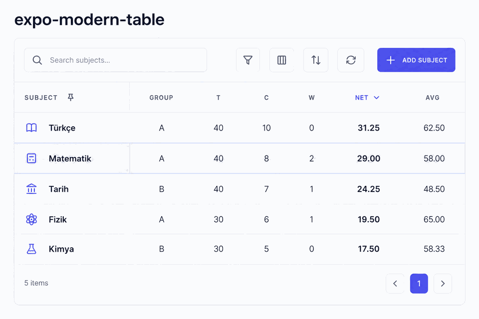
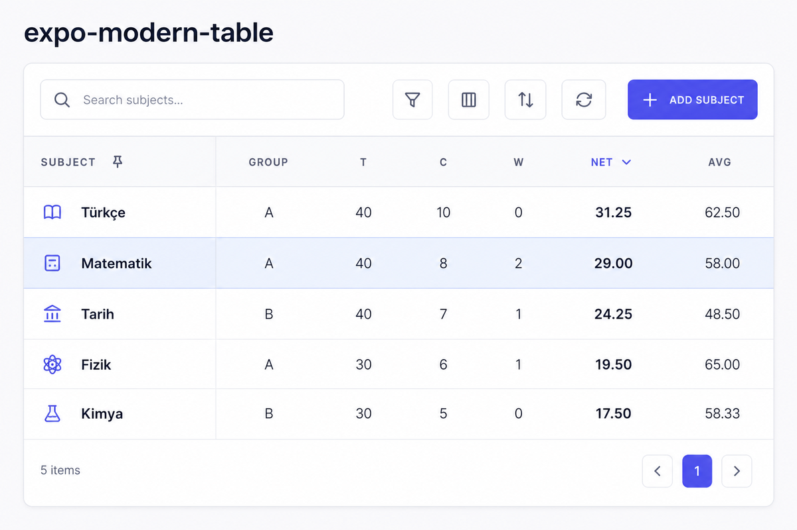
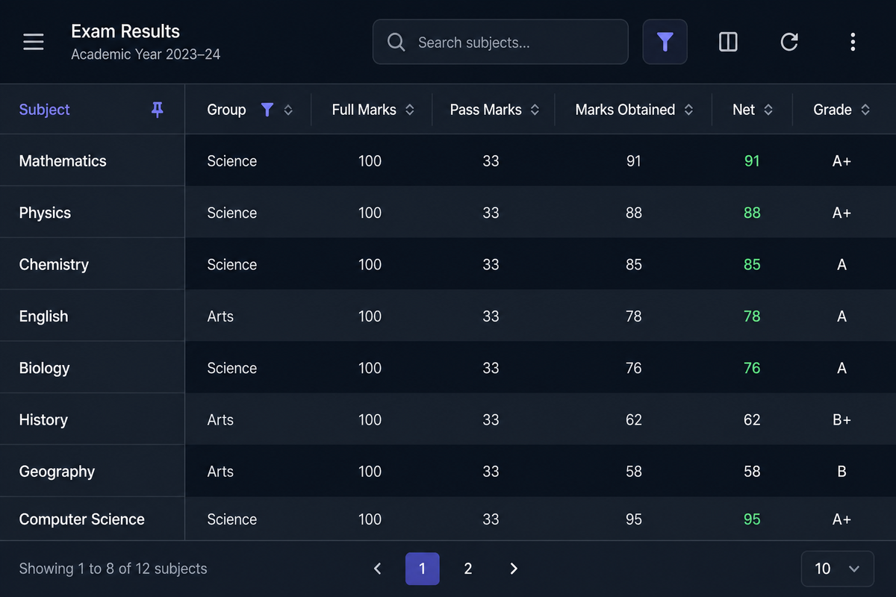
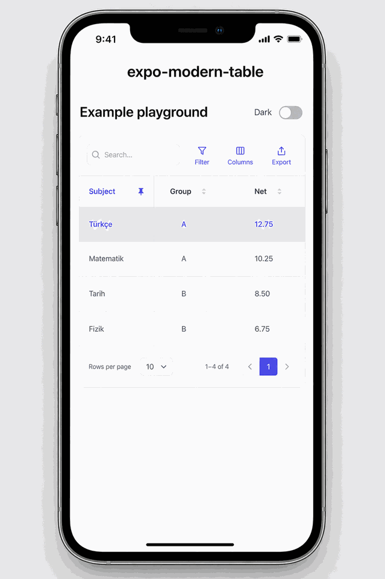
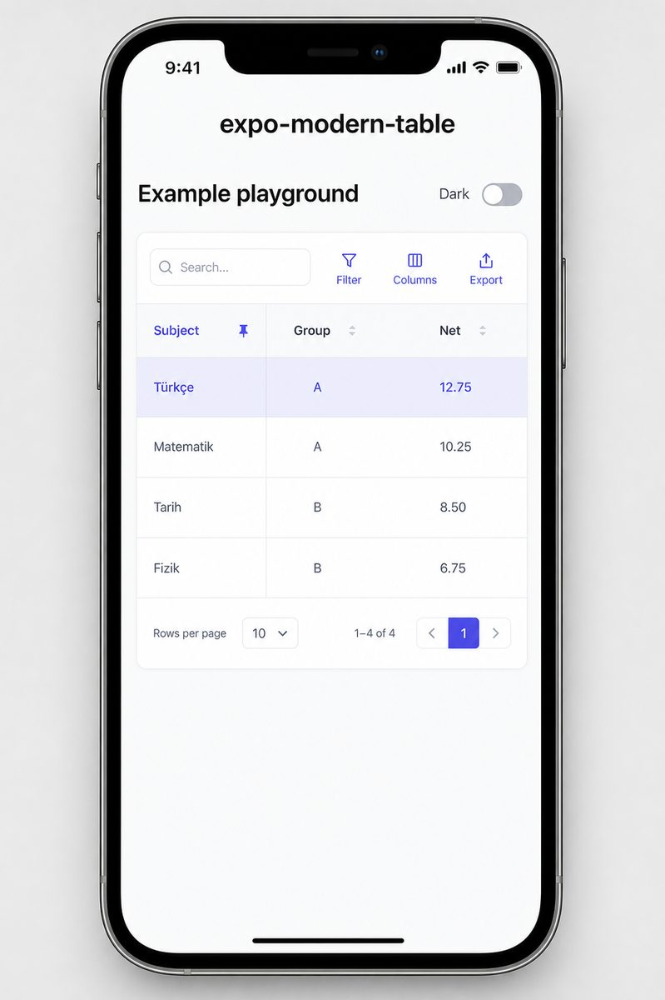
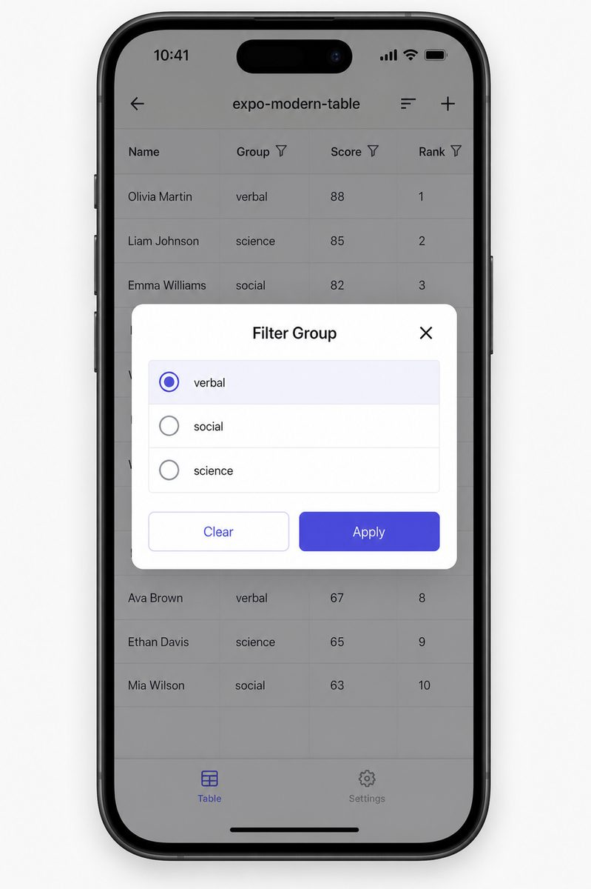
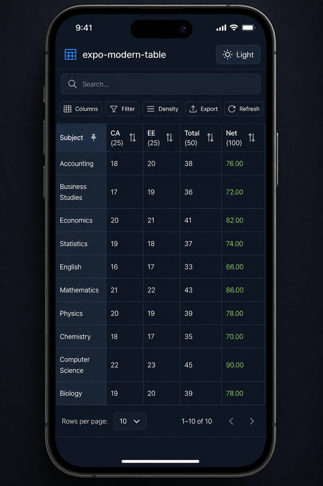

# expo-modern-table

A modern, feature-rich data table for **Expo** and **React Native**.

[](https://www.npmjs.com/package/expo-modern-table)
[](./LICENSE)
[](./example/README.md)

> Extracted from production use in [MyExamy](https://myexamy.com). Early `0.x` — API may evolve.

<p align="center">
  
</p>

<p align="center">
  
  &nbsp;
  
</p>

### Mobile (Expo Go)

<p align="center">
  
</p>

<p align="center">
  
  &nbsp;
  
  &nbsp;
  
</p>

## Features

- Horizontal sticky columns + sticky selection column
- Column sorting, filtering (text / select / boolean / number-range)
- Global search with Turkish-aware normalization
- Row selection (single / all)
- Column visibility + sticky toggles via toolbar
- Column reorder & row reorder (drag)
- Density modes: compact / standard / comfortable
- Light / dark themes + `themeConfig` overrides
- Custom fonts via theme (`fontFamily`)
- Pagination UI
- Inline cell editing
- Row grouping visual styles
- i18n via `translations` prop
- Built on [`@shopify/flash-list`](https://shopify.github.io/flash-list/)

## Install

```bash
npx expo install expo-modern-table @shopify/flash-list react-native-gesture-handler react-native-reanimated react-native-svg
npm install lucide-react-native
```

Optional (toolbar fullscreen / landscape lock):

```bash
npx expo install expo-screen-orientation
```

Make sure `GestureHandlerRootView` wraps your app and Reanimated babel plugin is enabled.

## Quick start

`useTable` owns state. `ModernTable` is controlled — spread `getTableProps()` and pass `columns`.

```tsx
import { ModernTable, useTable, Column } from 'expo-modern-table';

type Row = { id: string; name: string; score: number };

const columns: Column<Row>[] = [
  { key: 'name', title: 'Name', width: 160 },
  { key: 'score', title: 'Score', width: 100, align: 'right' },
];

export function ScoresTable({ data }: { data: Row[] }) {
  const table = useTable(data, columns, 20);

  return <ModernTable columns={columns} {...table.getTableProps()} />;
}
```

### State model

| Concern | Who owns it |
|---------|-------------|
| search, sort, filter, selection, density, visible/sticky columns, pagination | `useTable` (or your own controlled props) |
| `selectionMode`, `columnOrder` | Semi-controlled: pass props to control, else internal |
| cell editing, open filter modal | Always internal to `ModernTable` |

### Public exports

`ModernTable`, `useTable`, `useTableTheme`, types, themes, search helpers.

Toolbar / drag / checkbox / filter modal are **internal** — not part of the public API.

Removed / deferred props are tracked in [`docs/DEFERRED.md`](docs/DEFERRED.md).

## Theming

```tsx
<ModernTable
  columns={columns}
  {...table.getTableProps()}
  theme="dark"
  themeConfig={{
    primary: '#0ea5e9',
    fontFamily: {
      regular: 'Poppins_400Regular',
      medium: 'Poppins_500Medium',
      semibold: 'Poppins_600SemiBold',
      bold: 'Poppins_700Bold',
    },
  }}
  translations={{ empty: 'No rows yet', page: 'Page' }}
/>
```

## Peer dependencies

| Package | Required |
|---------|----------|
| `react` / `react-native` | yes |
| `@shopify/flash-list` | yes |
| `react-native-gesture-handler` | yes |
| `react-native-reanimated` | yes |
| `react-native-svg` | yes (for lucide icons) |
| `lucide-react-native` | yes |
| `expo-screen-orientation` | optional |

## Example app (Expo Go · SDK 54)

```bash
npm run example:go          # same Wi‑Fi — QR is in the terminal
cd example && npm run tunnel  # other network / friend testing
```

**Note:** `http://localhost:8082` is Metro only — it does not show the QR. Scan the terminal QR, or in Expo Go enter `exp://YOUR_IP:8082`.

Requires **Expo Go SDK 54**. Full tester steps: [`example/README.md`](example/README.md).

## Status

Published on npm as [`expo-modern-table@0.1.0`](https://www.npmjs.com/package/expo-modern-table).

- Public API polished (`0.x` — may evolve)
- Example app targets **Expo Go SDK 54**
- Deferred features: [`docs/DEFERRED.md`](docs/DEFERRED.md)

## License

MIT
